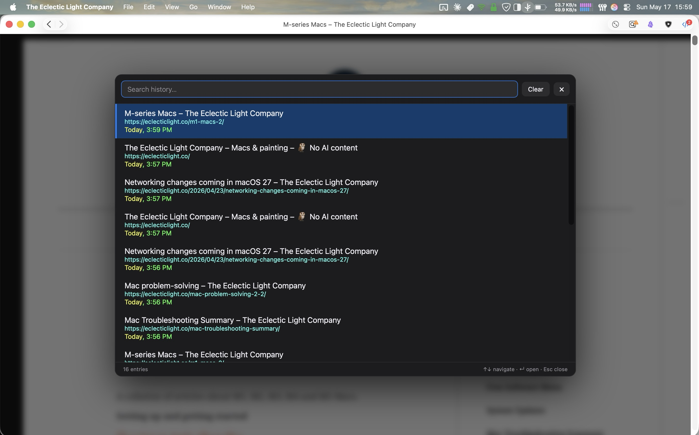

## MacOS Safari "Add to Dock" Web Apps

macOS Sonoma introduced the ability to add any website to the Dock as a standalone web app. These web apps run in their own window, separate from Safari, with their own cookies and settings. For a detailed look at how they work, see [How do Sonoma's Web Apps work?](https://eclecticlight.co/2023/10/05/how-do-sonomas-web-apps-work/) on Eclectic Light.

One notable limitation is that these web apps lack any way to view or navigate your browsing history within the app. There's no history menu, and no way to find a page you visited earlier. This userscript fills that gap.

# Browser History for Safari Web Apps



This userscript provides the missing browsing history functionality.

It records your browsing activity to pages you navigate to within the web app. It collects the URL, page title, and the date & time, storing each entry using GM storage APIs (setValue/getValue). All data is stored locally within the Userscripts extension sandbox and is not shared with any other domain or extension.  To view your browsing history, use the keyboard shortcut (default CMD + SHIFT + H) at any time. A panel will open showing your browsing history, with options to search, navigate, or clear history.

This script was designed for use with the [Userscripts](https://github.com/quoid/userscripts) Safari extension ([App Store](https://itunes.apple.com/us/app/userscripts/id1463298887)). The Userscripts extension must be installed from the MacOS App Store in order to ensure its works inside a Safari Web App. enable the Userscripts extension in your web app's settings under Settings > Extensions. Add this script, and modify the `@match` parameter to match the root domain of your web app, retaining the wildcards. 

## Installation

1. Install [Userscripts](https://itunes.apple.com/us/app/userscripts/id1463298887) from the Mac App Store.
2. Open your web app and enable the Userscripts extension under Settings > Extensions.
3. Add `browser-history-for-safari-webapps.user.js` to your Userscripts directory or by opening the Userscripts Extension page and pasting the code into a new JS script.
4. Edit the `@match` line at the top of the script to match your web app's domain, e.g.:
   ```
   // @match       *://*.example.com/*
   ```

## Usage

- Press **Cmd + Shift + H** to open the history panel (configurable in the `CONFIG` block).
- Type to search by title or URL.
- Use **Up/Down arrows** to navigate, **Enter** to open, **Esc** to close.
- Click any entry to jump to it.
- Use the **Clear** button to wipe all history.

## Configuration

All settings are in the `CONFIG` block at the top of the script:

| Setting | Default | Description |
|---------|---------|-------------|
| `MAX_ENTRIES` | 5000 | Maximum history entries stored |
| `SHORTCUT` | Cmd+Shift+H | Keyboard shortcut to toggle the panel |
| `TRACK_SPA` | true | Track single-page app navigation |
| `DEDUPE_CONSECUTIVE` | true | Skip duplicate consecutive URLs |
| `RECORD_DELAY_MS` | 250 | Delay before recording (lets SPAs set title) |

Colors, font sizes, and panel width are also configurable in the same block.
